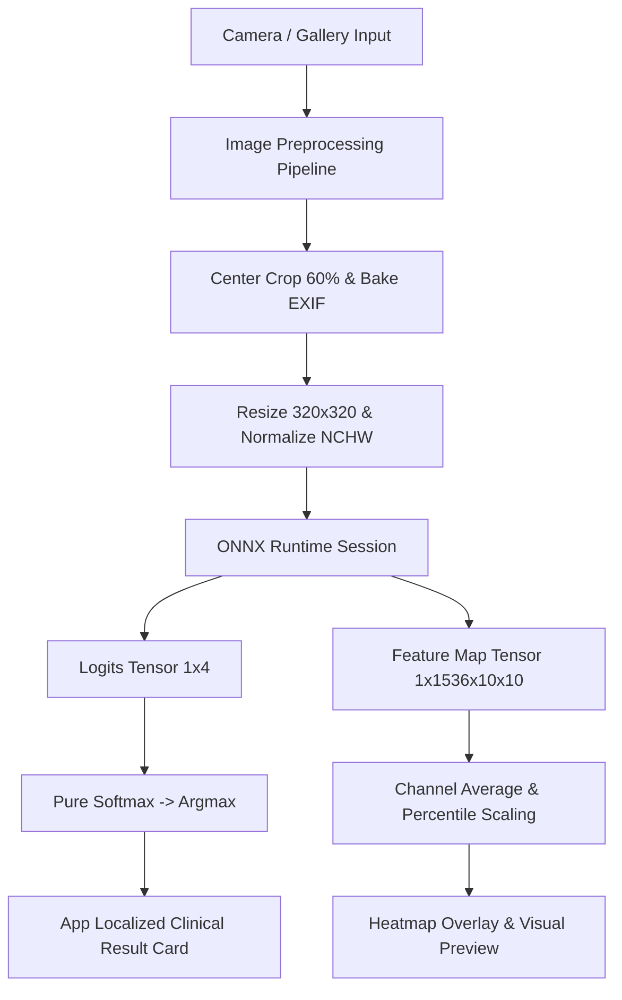

# System Architecture & Technical Specifications 🏗️

## 1. System Overview

DermaScout follows a modular, reactive architecture using Flutter and Provider for state management, coupled with a native C++ FFI bindings wrapper for ONNX Runtime.

---

## 2. In-Memory Data Flow

1. **Capture & Preprocessing**:
   - Camera image is captured as JPEG (`XFile`).
   - `img.bakeOrientation()` normalizes orientation.
   - 60% center crop isolates the target skin mark.
   - Resized to `320×320` resolution.
   - Converted to NCHW Float32 tensor and normalized with ImageNet stats.

2. **Inference Execution**:
   - `OrtSession.run()` executes the 32-bit FP32 ONNX model synchronously via native FFI.
   - Logits are evaluated with Softmax to derive probabilities across 4 classes.
   - Feature maps are averaged across all 1536 channels to produce a 10×10 feature grid.

3. **Heatmap Normalization**:
   - Corner padding artifacts (`[0,0]`, `[0,9]`, `[9,0]`, `[9,9]`) are suppressed.
   - Robust percentile scaling ($p_{15} \rightarrow p_{95}$) computes continuous thermal values (0.0 to 1.0).
   - Rendered using custom Canvas painting with a thermal colormap (Yellow $\rightarrow$ Orange $\rightarrow$ Red).

4. **Localization & Presentation**:
   - `AppState` broadcasts state updates to listening UI components.
   - `AppLocalization` provides UI strings and clinical descriptions dynamically in English, Hindi, and Kannada.
